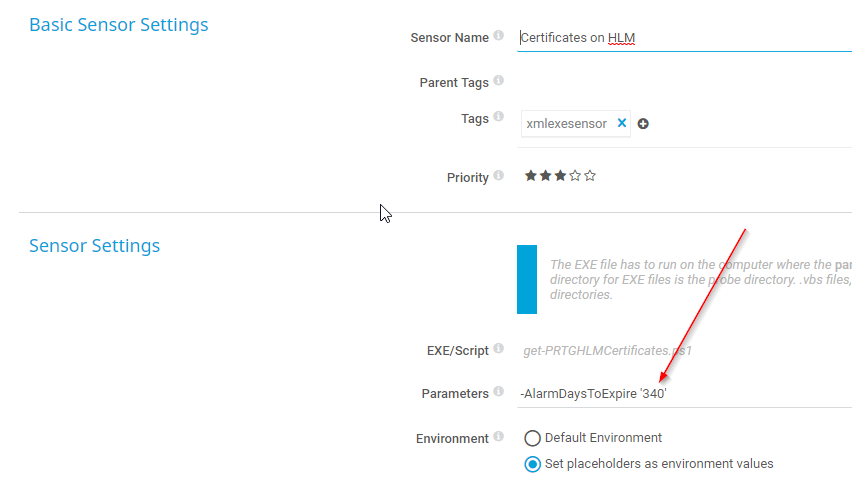

# PRTG Cusom XML sensor - get-PRTGHLMCertificates.ps1
Get all certificates under LocalMachine on the Device the sensor is deployed to
## Needed;
-	[PRTG](https://www.paessler.com/download/prtg-download)
-	Windows Host with Powershell 5.1+
 
## Result


## Instructions
Copy script to %ProgramFiles(x86)%\PRTG Network Monitor\Custom Sensors\EXEXML on all probes and add a 'XML Custom EXE' sensor.

``` Powershell
PARAMETERS
-ComputerName <String>
    Device to monitor, can be defined as '%host' in PRTG

    Required?                    false
    Position?                    1
    Default value
    Accept pipeline input?       false
    Accept wildcard characters?  false


-AlarmDaysToExpire <Int32>
    Days before an alarm text is returned if a certificate is about to expire.

    Required?                    false
    Position?                    2
    Default value                14
    Accept pipeline input?       false
    Accept wildcard characters?  false


-IgnoreThumbprint <String>
    Certificates with Thumbprints to ignored, separated by ';'

    Required?                    false
    Position?                    named
    Default value
    Accept pipeline input?       false
    Accept wildcard characters?  false


-DefinedThumbprint <String>
    Certificates with Thumbprints to monitor, separated by ';'. All other certificat
    es is ignored.

    Required?                    false
    Position?                    named
    Default value
    Accept pipeline input?       false
    Accept wildcard characters?  false
```

### All parameters;
* ComputerName - Device name of remote host.
* AlarmDaysToExpire - Number of days before certificate expires, if value is set at sensor creation also default alam limit will be configured. 
* IgnoreThumbprint - Monitors all certificates **except** Thumbprints defined in parameter. Multiple entrys eparated by ';'.
* DefinedThumbprint - If Parameter is populated **only** certificates with defined Thumbprints monitored. Multiple entrys eparated by ';'.

### Example
-ComputerName '%host' -AlarmDaysToExpire '30' -DefinedThumbprint '000000;444444'
## Tested on
- PRTG version 20.1.55.1775
- Windows server 2016
- Windows server 2019
- Windows 10 1903


## Error handling
YES! 
Returns error in script as text and fails sensor. 

## Bugs
Channel unit dont fully work as hoped on all systems. 
[PRTG Bug](https://kb.paessler.com/en/topic/81744-customunit-not-recognized-in-json-exe-script-advanced)
Workaround is to change unit manually on channel(s)


